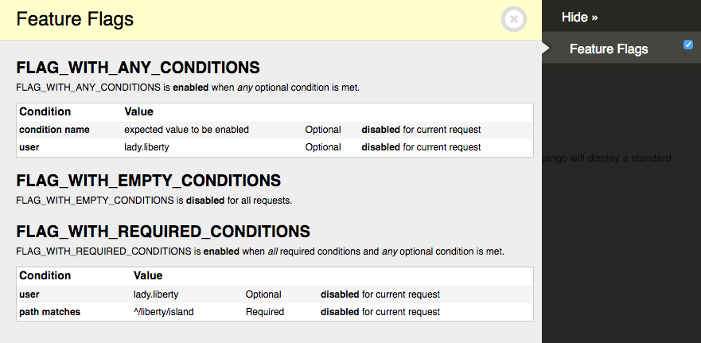

# Debugging

## System checks

<dl>
  <dt>`flags.E001`</dt>
  <dd>
    <p>Django-Flags includes a <a href="https://docs.djangoproject.com/en/stable/topics/checks/">Django system check</a> to check for flags that have non-existent conditions on start-up.</p>
    <pre><code>?: (flags.E001) Flag FLAG_WITH_ANY_CONDITIONS has non-existent condition "condition name".
HINT: Register "condition name" as a Django-Flags condition.</code></pre>
  </dd>
</dl> 

<dl>
  <dt>`flags.E002`</dt>
  <dd>
    <p>Django-Flags includes a <a href="https://docs.djangoproject.com/en/stable/topics/checks/">Django system check</a> to check to ensure that flag conditions have valid expected values on start-up.</p>
    <pre><code>?: (flags.E002) Flag FLAG_WITH_ANY_CONDITIONS's "boolean" condition has an invalid value.
HINT: Enter one of "on", "off", "true", "false".</code></pre>
  </dd>
</dl> 


## Exceptions

### `RequiredForCondition`

Django-Flags allows conditions to require any number of keyword arguments that must be passed when checking the condition. If a condition does not receive the necessary arguments, it may raise a `RequiredForCondition` exception, for example:

```python
Traceback (most recent call last):
  …
    raise RequiredForCondition("request is required for condition 'path'")
```

## Django Debug Toolbar Panels

### Flag conditions

Django-Flags comes with a panel for [Django Debug Toolbar](https://django-debug-toolbar.readthedocs.io/en/latest/index.html) that will list all flags, their conditions, and the state of each flag for the current request.



To enable the panel first follow the [installation and setup instructions for Django Debug Toolbar](https://django-debug-toolbar.readthedocs.io/en/latest/installation.html). Then add `flags.panels.FlagsPanel` to the `DEBUG_TOOLBAR_PANELS` setting:

```python
DEBUG_TOOLBAR_PANELS = [
    # …
    'flags.panels.FlagsPanel',
    # …
]
```

### Flag checks

Django-Flags comes with a panel for [Django Debug Toolbar](https://django-debug-toolbar.readthedocs.io/en/latest/index.html) that will show which flags were checked during a request, how many times it was checked, and what the results of those checks were.


To enable the panel first follow the [installation and setup instructions for Django Debug Toolbar](https://django-debug-toolbar.readthedocs.io/en/latest/installation.html). Then add `flags.panels.FlagChecksPanel` to the `DEBUG_TOOLBAR_PANELS` setting:

```python
DEBUG_TOOLBAR_PANELS = [
    # …
    'flags.panels.FlagChecksPanel',
    # …
]
```
